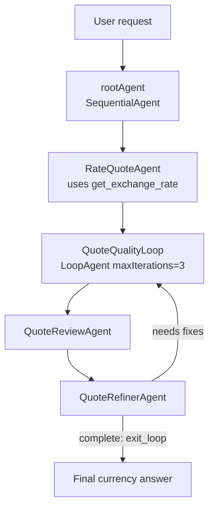

# ADK Workshop

Google ADK TypeScript agent for currency exchange questions.

The root agent is a `SequentialAgent`: it drafts a currency answer, then a
`LoopAgent` reviews/refines it until complete or `maxIterations` is reached.
Tools live in `src/currency-agent/tools`; sub-agents live in
`src/currency-agent/sub-agents`.

## Diagram



https://mermaid.live

## Run

```sh
pnpm install
pnpm start
```

For the ADK web UI:

```sh
pnpm web
```

## Simulate the Loop

Try:

```text
Convert 125 USD to EUR and include the rate date.
```

Expected flow:

```text
RateQuoteAgent
QuoteQualityLoop
  QuoteReviewAgent
  QuoteRefinerAgent
```

To force extra iterations, temporarily make
`src/currency-agent/sub-agents/quote-review-agent.ts` stricter, for example add
one more completion criterion:

```text
The answer must include a one-line caveat that rates vary by provider.
```

The first draft should miss it, the reviewer asks for a fix, the refiner updates
the answer, then the next review can call `exit_loop`.

## Project

- `src/currency-agent/agent.ts`: root workflow and loop wiring
- `src/currency-agent/sub-agents`: quote, review, and refiner agents
- `src/currency-agent/tools`: exchange-rate and loop-exit tools
- `package.json`: ADK scripts and dependencies
