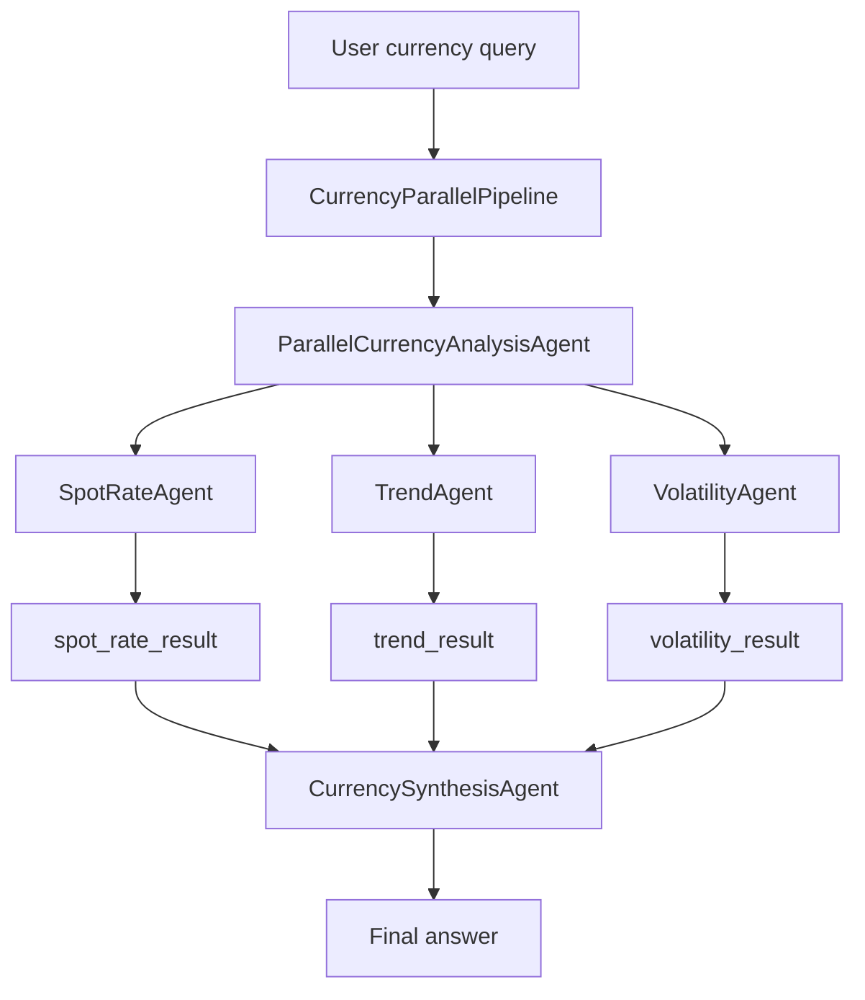

# ADK Workshop

Google ADK TypeScript agent for currency exchange questions.

The root agent is a sequential pipeline:

1. `ParallelCurrencyAnalysisAgent` runs independent sub-agents for spot rate,
   recent trend, and recent range.
2. `CurrencySynthesisAgent` combines their state outputs into one answer.

Tools live in `src/currency-agent/tools`. Sub-agents live in
`src/currency-agent/sub-agents`.



## Run

```sh
pnpm install
pnpm start
```

For the ADK web UI:

```sh
pnpm web
```

## Project

- `src/currency-agent/agent.ts`: parallel workflow pipeline
- `src/currency-agent/sub-agents`: spot, trend, and volatility agents
- `src/currency-agent/tools`: Frankfurter exchange-rate tools
- `package.json`: ADK scripts and dependencies
